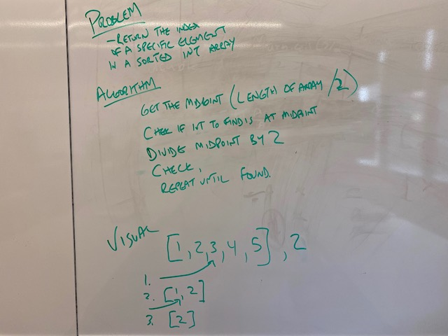

# Challenge 2 - Array Shift

## Challenge Summary
 * Insert an item into the middle of an array
 * Remove an item from the middle of an array

## Challenge Description
 * As arrays are fixed size in Java, this means writing a function which takes in an array and returns a new array, with the correct new values

## Approach
 * For inserting an item into the middle, my approach was to calculate the midpoint, insert that item, then loop through the array, testing the index for before the midpoint (insert item at position in the middle of the array) and after the midpoint (insert item at original position + 1)

## Solution

# Challenge 3 - Binary Search

## Challenge Summary
 * Given an array of sorted integers, return the index of a specified integer.

## Challenge Description
 * This means continually evaluating whether the value you're looking for is higher or lower than the midpoint of your dataset, and adjusting the dataset accordingly each time

## Approach
 * My initial approach turned out wrong - I tried this:
 >if midpoint > int to find:

 >lowerBound stays the same
 >upperBound = midpoint
 >midpoint = upperBound / 2

 >if midpoint < int to find:

 >lowerBound = midpoint
 >upperbound stays the same
 >midpoint = lowerbound + (upperbound / 2)

 * This only succeeded if the int to find was less than the midpoint to start with. After trying to derive the correct algorithm for a while, I noticed the wiki page linked in the code challenge, which had the correct solution.

## Solution

