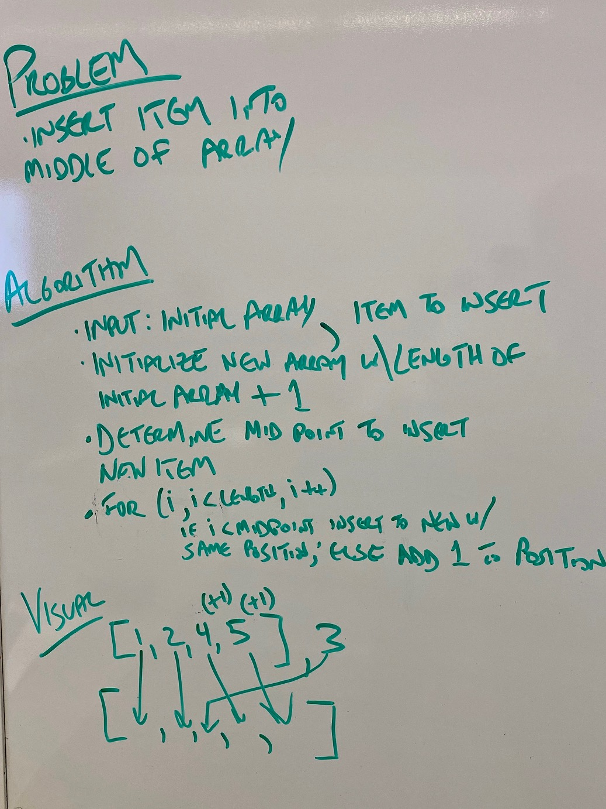

# Challenge 2 - Array Shift

## Challenge Summary
 * Insert an item into the middle of an array
 * Remove an item from the middle of an array

## Challenge Description
 * As arrays are fixed size in Java, this means writing a function which takes in an array and returns a new array, with the correct new values

## Approach
 * For inserting an item into the middle, my approach was to calculate the midpoint, insert that item, then loop through the array, testing the index for before the midpoint (insert item at position in the middle of the array) and after the midpoint (insert item at original position + 1)

## Solution

